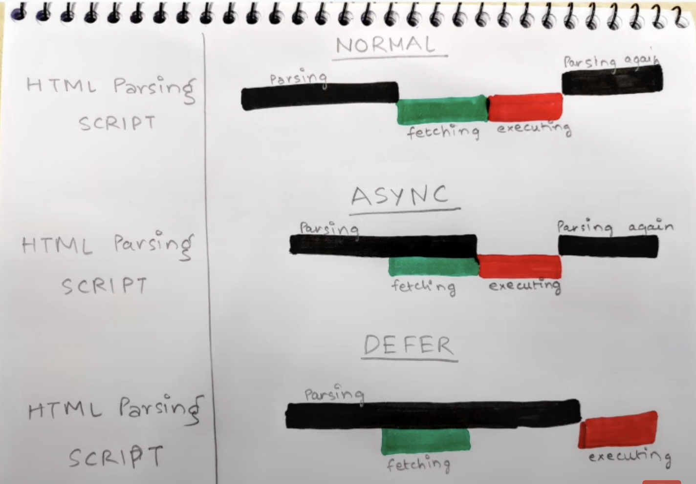

# Assignment 1

### 1. What is Emmet?
1. Emmet is a plugin or developer tool kit that helps make your work faster and substantially enhances HTML and CSS workflows.
2. As the name implies, Emmet Abbreviation saves you time and effort while allowing you to focus on more important matters. By converting acronyms into blocks of structured code in (X)HTML, CSS, XML, XSL, and JSP, Emmet speeds up coding.

### 2. Difference between a Library and Framework?
1. Libraries provide reusable code blocks to perform specific tasks, while frameworks define the overall structure and workflow of an application.

2. Example: Imagine building a house. A library is like a collection of prefabricated building blocks, such as walls, doors, and windows. You can select the blocks you need and assemble them into a customized house. A framework is like the foundation and skeleton of the house, providing the overall structure and guiding the construction process.

### 3. What is CDN? Why do we use it?
1. A content delivery network (CDN) is a geographically distributed network of servers that delivers web content to users based on their proximity to the closest server. 

2. This helps to improve website performance and availability by reducing the time it takes for users to load web pages, images, and videos.

3. Example: Imagine you're in New York City and you want to access a website hosted in Los Angeles. Without a CDN, your browser would have to make a direct request to the Los Angeles server, which could take several seconds depending on network conditions. With a CDN, your browser would instead be directed to a server located closer to you, such as one in Chicago, which could significantly reduce the loading time.

### 4. Why is React known as React?

1. React is named "React" because it is designed to be a reactive JavaScript library for building user interfaces (UIs). 

2. It efficiently updates and renders UI components in response to changes in application state, creating a seamless and responsive user experience. The name "React" aptly reflects this core feature.

### 5. What is crossorigin in script tag?
1. The crossorigin attribute in the script tag enables Cross-Origin Resource Sharing (CORS) for loading external JavaScript files from a different origin than the hosting web page. This allows the script to access resources from the server hosting the script, such as making HTTP requests or accessing data.

2. Here's an example of using the crossorigin attribute:

    ```html
    <script src="https://example.com/script.js" crossorigin="anonymous"></script>
    ```

3. In this example, the script file script.js is loaded from the domain example.com, which is a different origin than the hosting web page. The crossorigin="anonymous" attribute ensures that the script cannot access sensitive information from the hosting web page.

### 6. What is diference between React and ReactDOM?
1. React focuses on building UI components and managing their state, while ReactDOM handles the actual rendering of those components into the browser's DOM.

### 7. What is difference between react.development.js and react.production.js files via CDN?
1. The react.development.js and react.production.js files are two different versions of the React library that are distributed via a content delivery network (CDN). 

2. The main difference between the two files is that the development version is optimized for debugging and development, while the production version is optimized for performance and deployment.

3. In general, you should use the react.development.js file when you are developing and debugging your React application. Once you are ready to deploy your application to production, you should switch to the react.production.js file.
### 8. What is async and defer?

1. In Normal HTML Parsing, html parsing goes on, as soon as the script tag is encountered, html parsing is stopped and the script is feteched from the network and then they are executed and then after that HTML parsing continues.

2. In Async HTML Parsing, html parsing goes on, and scripts are fetched in asyn manner i.e. parallely. Once the scripts are available, html parsing is stopped and scripts are executed and then after that HTML parsing continues.

3. In Defer HTML Parsing, html parsing goes on, and scripts are fetched in asyn manner i.e. parallely and will start the execution after the completion of the html parsing.

    

4. <span style='color:red'>Async attribute dos not guarantee the order of execution of the scripts. But Defer does guarantee. So Defer is Preferable. </span>

### 9. Why React is a Library? (Question by me)
1. React is considered a library because it focuses on rendering user interfaces and doesn't dictate the application's structure or workflow. 

2. It provides reusable UI components and tools but leaves the overall architecture and state management up to the developer, making it flexible and customizable.